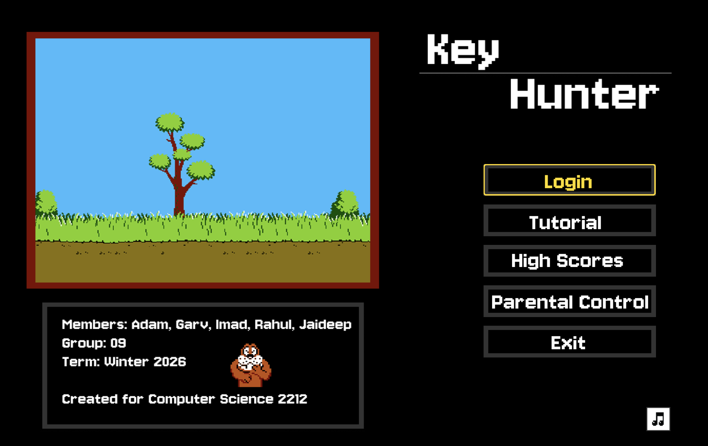

<h1 align="center">Key Hunter</h1>

<p align="center"></p>

## Description

KeyHunter is a Duck Hunt themed educational typing game developed for CS 2212 at the University of Western Ontario. Players shoot down flying targets by typing the words displayed on them before they escape across the screen. The game features three distinct game modes, a player account system, a high score leaderboard, player statistics tracking, and parental controls.

**Core Features:**
- Three game modes: Normal (10 progressive levels), Endless (survival), and Timed (score as high as possible in a fixed time)
- Player accounts with login/password authentication
- Per-account statistics (WPM, accuracy, total words typed, sessions, etc.)
- Persistent high score leaderboard
- Parental control panel (PIN-protected) for managing accounts, resetting stats, and clearing scores
- Adjustable volume and audio settings per account
- Animated bird sprites, background music, and sound effects
- In-game tutorial

---

## Required Libraries and Third-Party Tools

| Tool / Library | Version | Purpose |
|---|---|---|
| Java Development Kit (JDK) | 17 or higher (tested on Java 25.0.1) | Compiling and running the application |
| JUnit Platform Console Standalone | 1.13.0-M3 | Running JUnit 5 unit tests (must be downloaded, see below) |

> **Note:** No external build tool (Maven, Gradle) is required. All compilation is done directly with `javac`.

---

## Building from Source

### Prerequisites

1. Install the [Java Development Kit (JDK) 17 or higher](https://www.oracle.com/java/technologies/downloads/).
2. Verify your installation by running:
   ```
   java -version
   javac -version
   ```
   Both commands should report version 17 or higher.

3. Download the JUnit 5 standalone JAR and place it in the `lib/` directory:
   ```
   mkdir -p lib
   curl -L -o lib/junit-platform-console-standalone-1.13.0-M3.jar \
     https://repo1.maven.org/maven2/org/junit/platform/junit-platform-console-standalone/1.13.0-M3/junit-platform-console-standalone-1.13.0-M3.jar
   ```
   Or download it manually from Maven Central and save it as `lib/junit-platform-console-standalone-1.13.0-M3.jar`.

   > The JUnit JAR is only required for running tests (Step 4). You can skip this step if you only want to build and run the game.

4. Create the `data/` directory and empty data files (these are not tracked in the repository):
   ```
   mkdir -p data
   echo "[]" > data/players.json
   echo "[]" > data/highscores.json
   ```

### Step-by-Step Build Instructions

All commands below should be run from the **root of the repository** (`group09/`).

**Step 1 — Create the output directory:**
```
mkdir -p out/production/group09
```

**Step 2 — Compile all source files:**
```
javac -d out/production/group09 -sourcepath src/main $(find src/main -name "*.java")
```

**Step 3 — Copy assets into the output directory** (required for images, audio, and fonts to load at runtime):
```
cp -r src/main/assets out/production/group09/
```

**Step 4 — Compile and run the JUnit tests:**
```
javac -d out/test -cp out/production/group09:lib/junit-platform-console-standalone-1.13.0-M3.jar \
  $(find src/test -name "*.java")

java -jar lib/junit-platform-console-standalone-1.13.0-M3.jar \
  --class-path out/production/group09:out/test \
  --scan-class-path
```
> On Windows, replace `:` with `;` in all classpaths.

**Step 5 — Build a runnable JAR:**
```
jar --create --file KeyHunter.jar \
    --main-class main.ui.KeyHunterApp \
    -C out/production/group09 .
```

**Step 6 — Generate Javadoc:**
```
javadoc -d docs -sourcepath src/main -subpackages main
```
The generated HTML documentation will be written to the `docs/` directory.

---

## Running the Application

### Option A — Run from compiled `.class` files

From the **root of the repository**, run:
```
java -cp out/production/group09 main.ui.KeyHunterApp
```

> The application **must** be launched from the repository root so that the relative paths `data/players.json` and `data/highscores.json` resolve correctly.

### Option B — Run from the JAR file

If you built `KeyHunter.jar` in Step 5 above, run it from the repository root:
```
java -jar KeyHunter.jar
```

---

## User Guide

### Logging In / Creating an Account

- When the game launches, the **Main Menu Screen** is shown.
- To create a new account go to **Parental Controls**, enter the pin and create a child account.
- Then go back to the menu and login using those details.
- All account data (stats, settings, unlocked levels) is stored in `data/players.json`.

### Main Menu

After logging in you will reach the **Main Menu**, which offers:
- **Play** — Choose a game mode and start playing.
- **High Scores** — View the global leaderboard.
- **Stats** — View your personal statistics.
- **Settings** — Adjust volume and toggle music/sound effects.
- **Parental Controls** — Access the PIN-protected parental control panel.
- **Tutorial** — Watch an interactive guide explaining the controls.
- **Logout** — Return to the login screen.

### Selecting a Game Mode

After clicking **Play**, choose one of three modes:

| Mode | Description |
|---|---|
| **Normal** | 10 progressive levels of increasing difficulty. Complete each level to unlock the next. |
| **Endless** | Survive as long as possible with no level cap. Difficulty increases continuously. |
| **Timed** | Score as many points as possible before the timer runs out. |

### Gameplay

- Words appear attached to animated bird sprites flying across the screen.
- **Type the word exactly** and press **Enter** or **Space** to shoot the bird.
- Typing begins matching the word as soon as you start; the word highlights as you type correctly.
- If a bird reaches the other side of the screen, you lose a life.
- You have **3 lives** per session. The game ends when all lives are lost (or in Normal mode, when a level is completed).
- **Power-up:** Successfully type 10 words in a row to earn a double-points bonus for the next word.
- Press **Escape** to pause the game.

### Scoring

| Event | Points |
|---|---|
| Correct word typed | Base points scaled by word length and current level |
| Double-points power-up | 2× base points for next word |
| Missed word (life lost) | No points; lose 1 life |

### Settings

Accessible from the Main Menu or the in-game pause panel:
- **Volume** — Slider from 0–10.
- **Music** — Toggle background music on/off.
- **Sound Effects** — Toggle sound effects on/off.

Settings are saved per account automatically on change.

---

## Parental Controls

The parental control panel is accessible from the **Main Menu** by clicking **Parental Controls**.

### Default PIN

```
1234
```

## Test User

Username: Player1
Password: Pass

### Available Actions

| Action | Description |
|---|---|
| **View Player Stats** | View detailed statistics for any account. |
| **Reset Player Stats** | Clear all statistics for a selected account. |
| **Reset Player Password** | Set a new password for any account. |
| **Clear High Scores** | Wipe the global high score leaderboard. |
| **Create Child Account** | Register a new restricted account. |

> **Note:** The parental control PIN is hardcoded as `"1234"` in `src/main/ui/KeyHunterApp.java:43`. 


## Additional Notes

- The application **must be run from the repository root** — it loads `data/players.json` and `data/highscores.json` using relative paths.
- The following directories are **not included in the repository** (gitignored) and must be created manually before building:
  - `lib/` — download the JUnit JAR as described in Prerequisites step 3.
  - `data/` — create with empty `players.json` and `highscores.json` arrays as described in Prerequisites step 4.
  - `out/` — created automatically by the build steps.
  - `docs/` — regenerated by Step 6 of the build. 
